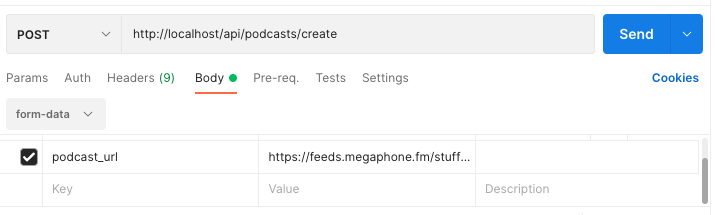

## RSS Importer

This is my approach to solve a request to have podcasts rss urls and parse the xml into a database.

I used <a href="https://github.com/docker-php/docker-php">docker-php</a> project as a base to met the requirement for the test

<h3>Versions</h3>
<ul>
  <li>Docker desktop ver 4.3.0</li>
  <li>Compose ver 1.29.2</li>
  <li>PHP ver 8.1.0</li>
  <li>MySQL ver 8.0.27</li>
  <li>nginx ver 1.21.4</li>
  <li>Laravel 8</li>
</ul>

<h3>Tools used</h3>
<ul>
    <li>VS Code</li>
    <li>Chrome Browser</li>
    <li>Macbook Pro with Catalina OS</li>
    <li>3 cups of coffee, 1 cup of tea and 1 donut glassed</li>
</ul>

## Install

Get the code

<code>git clone https://github.com/xalfeiran/rss-importer.git</code>

Run Laravel sail

<code>./vendor/bin/sail up</code>

Setup Database settings in .env file

Run migrations

<code>php artisan migrate</code>

## Whats included

<ul>
    <li>The code for the project, based in laravel</li>
    <li>test-story.txt file a step by step of what has been done<li>
    <li>this Readme.md </li>
    <li>docker-composer.yaml</li>
</ul>

## Use

The project is made to be called by artisan command (but prepared to adapt the controllers to be called from a api 

Sample calls

To test if the provided url returns a valid podcast xml 
<code>php artisan command:test-podcast-url https://nosleeppodcast.libsyn.com/rss</code>

To test if the provided url returns a list of episodes 
<code>php artisan command:test-podcast-episodes-url https://nosleeppodcast.libsyn.com/rss</code>

Run the actual import 
<code>php artisan command:import-podcast-to-library https://feeds.megaphone.fm/stuffyoushouldknow</code>
Sample output
<code>Podcast information loaded
Took 10 seconds</code>

## Test 

A set of test cases has been created
<ul>
    <li>Feature/ImportPodcastTest.php   Try import a podcast url/rss</li>
    <li>Feature/URLTest.php             Try test if url is from a podcast</li>
    <li>Feature/RequestAPITest.php      Try the api with a post request</li>
</ul>

## What's next

Other than calling this process by command line, it may be needed to make a call using a api to the sample code provides a good start

create a route in the api.php file 
<code>Route::post('/podcasts/create', 'App\Http\Controllers\PodcastsController@createFromRequest');</code>

Review the PodcastController on the createFromRequest method 
<code>
    // sample method to call the podcast creation from a request
    public function createFromRequest(Request $request)
    {
        // get the podcast information
        $podcast_url = $request->podcast_url;
        // call the podcast creation
        $podcast = $this->create($podcast_url);

        // return a json response
        return response()->json($podcast);
    }
</code>

Make a call from let's say Postman to: <code>http://localhost/api/podcasts/create</code>

Result (if the provided URL is from a valid rss ) must be a json from a podcast 

<code>
    {
    "id": 2,
    "title": "Stuff You Should Know",
    "artwork_url": "https://megaphone.imgix.net/podcasts/1e705dd4-2de6-11e8-b55d-9ba6ddb3f75e/image/uploads_2F1546996139536-0o3pw93d8mk-d5f1143c14a746754c55efb478c66988_2FSKSKLogo-FINAL-iHR-3000x3000.png?ixlib=rails-2.1.2&max-w=3000&max-h=3000&fit=crop&auto=format,compress",
    "rss_feed_url": "https://feeds.megaphone.fm/stuffyoushouldknow",
    "description": "If you've ever wanted to know about champagne, satanism, the Stonewall Uprising, chaos theory, LSD, El Nino, true crime and Rosa Parks, then look no further. Josh and Chuck have you covered.",
    "language": "en",
    "website_url": "https://www.iheart.com/podcast/105-stuff-you-should-know-26940277/",
    "created_at": "2022-01-26T14:52:18.000000Z",
    "updated_at": "2022-01-26T14:52:18.000000Z"
}
    </code>
    
## What if I had a little more time?
<ul>
    <li>Implement user authentication to assign who did what</li>
    <li>Right now it only checks for a valid xml, if not returns false, but a proper validation is required</li>
    <li>limits? calling the rest api can be heavy on the client and server, implementing limits to distribute the load maybe</li>
    <li>CRUD for podcast, requesting info, updating individually</li>
    <li>Categories, and adding a little more info on the tables</li>
    <li>Audio files can be available in more than one type of file aac, mp3, etc. And to be able to store all of them in a separate table in case needed</li>
 </ul>

## Thanks

    Just for the opportunity to be part of the job application participants 

## License

The Laravel framework is open-sourced software licensed under the [MIT license](https://opensource.org/licenses/MIT).
